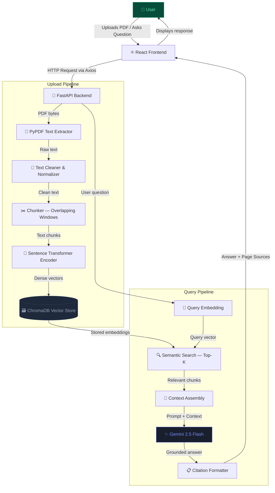
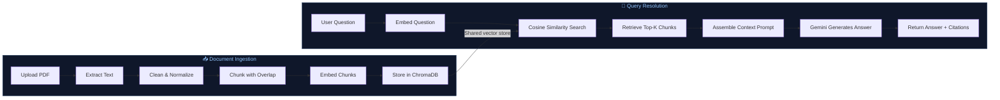
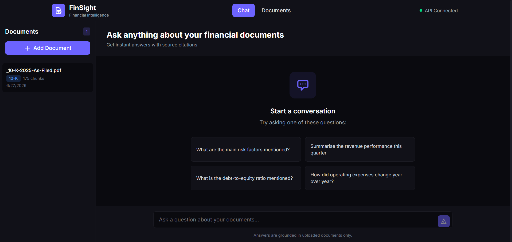
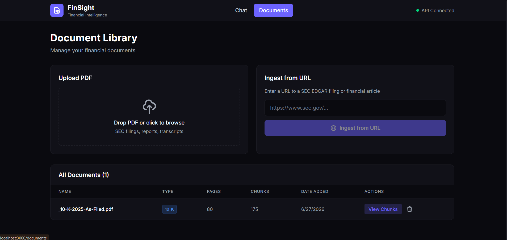
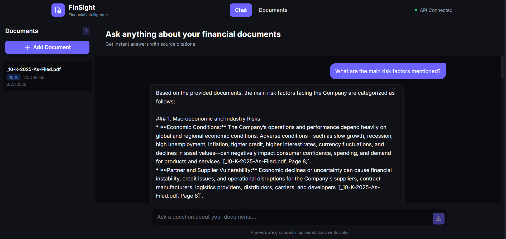
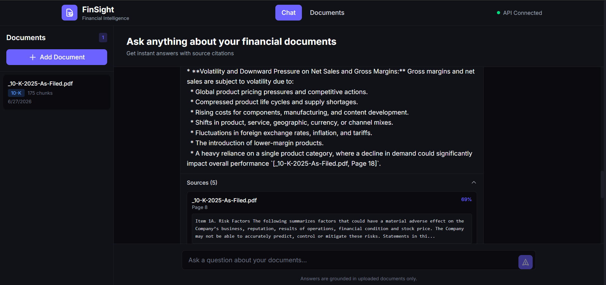

<div align="center">
  
</div>

<br />

```
███████╗██╗███╗   ██╗███████╗██╗ ██████╗ ██╗  ██╗████████╗
██╔════╝██║████╗  ██║██╔════╝██║██╔════╝ ██║  ██║╚══██╔══╝
█████╗  ██║██╔██╗ ██║███████╗██║██║  ███╗███████║   ██║   
██╔══╝  ██║██║╚██╗██║╚════██║██║██║   ██║██╔══██║   ██║   
██║     ██║██║ ╚████║███████║██║╚██████╔╝██║  ██║   ██║   
╚═╝     ╚═╝╚═╝  ╚═══╝╚══════╝╚═╝ ╚═════╝ ╚═╝  ╚═╝   ╚═╝  
```

### **AI-Powered Financial Document Intelligence**

*Ask questions. Get answers. Grounded in your documents — not AI guesswork.*

<br />

[](https://python.org)
[](https://fastapi.tiangolo.com)
[](https://react.dev)
[](https://tailwindcss.com)
[](https://trychroma.com)
[](https://deepmind.google/technologies/gemini/)

<br />

[](LICENSE)
[](CONTRIBUTING.md)
[](https://github.com/yourusername/finsight/stargazers)
[](https://github.com/yourusername/finsight/issues)
[](https://github.com/yourusername/finsight/commits)

<br />

> **FinSight** is a production-grade Retrieval-Augmented Generation (RAG) platform purpose-built for financial documents.  
> Upload SEC 10-Ks, earnings reports, and annual filings — then query them in natural language with answers **sourced directly from the document**, not hallucinated by the model.

<br />

</div>

---

## 🎬 Demo

<div align="center">


<br /><br />

> **📁 To add your demo:** Record your screen, export as `demo.gif`, and place it at `assets/demo.gif`.  
> Recommended tools: [Kap](https://getkap.co/) (macOS), [ScreenToGif](https://www.screentogif.com/) (Windows), or [Peek](https://github.com/phw/peek) (Linux).

</div>

---

##  Why FinSight?

### The Problem with Asking AI About Finance

When financial analysts, compliance officers, or investors ask a general-purpose LLM questions like *"What was Apple's revenue in FY2023?"* or *"What risk factors did management disclose?"*, the model **makes up an answer based on its training data** — which may be outdated, imprecise, or simply wrong.

In finance, a hallucinated figure is not a minor inconvenience. It is a liability.

> *"A confident but fabricated earnings figure can inform a bad trade. A misquoted risk factor can fail a compliance audit. In finance, hallucinations have consequences."*

### How RAG Fixes It

**Retrieval-Augmented Generation (RAG)** changes the architecture entirely.

Instead of asking the model what it *remembers*, FinSight first retrieves the most relevant passages directly from the uploaded document — then provides those passages as grounded context before the model generates any response.

The model can only answer using what is **actually in your document**. Every answer includes source citations and page references, making it auditable, traceable, and trustworthy.

| Approach | Source of Truth | Hallucination Risk | Auditable |
|---|---|---|---|
| Direct LLM prompting | Model's training memory | 🔴 High | ❌ No |
| FinSight RAG Pipeline | Your uploaded document | 🟢 Very Low | ✅ Yes |

FinSight simulates the document intelligence infrastructure used by **investment banks, consulting firms, legal organizations, and financial institutions** — built as an open-source, portfolio-grade system.

---

## ✨ Key Features

### 📄 Document Intelligence

| Feature | Description |
|---|---|
| 📤 **PDF Upload** | Upload any financial PDF directly from the browser |
| 🔍 **Text Extraction** | Precision extraction via PyPDF with cleaning and normalization |
| ✂️ **Smart Chunking** | Overlapping chunk strategy preserves cross-paragraph context |
| 📑 **Source Citations** | Every answer references the exact page it came from |
| 📊 **Multi-Format Support** | SEC 10-Ks, earnings releases, annual reports, investor presentations |

### 🤖 AI & Language Model

| Feature | Description |
|---|---|
| 🧬 **Gemini 2.5 Flash** | Google's latest fast, reasoning-optimized model as the answer engine |
| 📎 **Context-Grounded Answers** | Model responds *only* using retrieved document context |
| 🛡️ **Hallucination Reduction** | RAG architecture prevents the model from fabricating financial data |
| 🎯 **Prompt Engineering** | Custom system prompts enforce citation-first, factual-only responses |

### 🔎 Semantic Search

| Feature | Description |
|---|---|
| 🧲 **Sentence Transformers** | `all-MiniLM-L6-v2` encodes both documents and queries into dense vectors |
| 🗃️ **ChromaDB Vector Store** | Local, persistent vector database for fast similarity retrieval |
| 📐 **Top-K Retrieval** | Returns the K most semantically relevant chunks per query |
| 🔁 **Query Embedding** | User questions are embedded in real-time and matched to stored chunks |

### 🖥️ Frontend & UX

| Feature | Description |
|---|---|
| ⚛️ **React 18** | Component-based SPA with clean state management |
| 🎨 **Tailwind CSS** | Utility-first styling — responsive and polished |
| 💬 **Chat Interface** | Conversational Q&A experience with document context |
| 📋 **Source Panel** | Surfaced source chunks and page numbers alongside every answer |
| ⚡ **Axios HTTP Client** | Non-blocking async requests to the FastAPI backend |

### ⚙️ Backend & Infrastructure

| Feature | Description |
|---|---|
| 🚀 **FastAPI** | High-performance Python API with automatic OpenAPI docs |
| 🐍 **Python 3.11+** | Modern async-compatible backend |
| 🔐 **Environment Variables** | `python-dotenv` for secure API key management |
| 🐳 **Docker Ready** | Containerization support planned (see roadmap) |

---

## 🏛️ Architecture



---

## 🔄 System Workflow — Full RAG Pipeline




## 🛠️ Tech Stack

| Layer | Technology | Version | Purpose |
|---|---|---|---|
|  | **React** | 18 | Frontend SPA framework |
|  | **Tailwind CSS** | 3.4 | Utility-first styling |
|  | **Axios** | Latest | Async HTTP client |
|  | **FastAPI** | 0.110+ | Python REST API server |
|  | **Python** | 3.11+ | Backend runtime |
|  | **Gemini 2.5 Flash** | Latest | Large language model |
| 🤗 | **Sentence Transformers** | `all-MiniLM-L6-v2` | Text embedding model |
| 🗃️ | **ChromaDB** | Latest | Local vector database |
| 📄 | **PyPDF** | Latest | PDF text extraction |
| 🔐 | **python-dotenv** | Latest | Environment config |
| 🐳 | **Docker** | *(planned)* | Containerization |

---

## 📁 Project Structure

```
finsight/
│
├── backend/
│   ├── main.py                 # FastAPI app entry point
│   ├── routes/
│   │   ├── upload.py           # PDF upload & ingestion endpoint
│   │   └── query.py            # Question answering endpoint
│   ├── services/
│   │   ├── pdf_processor.py    # PyPDF extraction & text cleaning
│   │   ├── chunker.py          # Overlapping chunk strategy
│   │   ├── embedder.py         # Sentence Transformer embeddings
│   │   ├── vector_store.py     # ChromaDB interface
│   │   └── llm.py              # Gemini API integration
│   ├── utils/
│   │   └── helpers.py          # Shared utility functions
│   ├── requirements.txt
│   └── .env                    # API keys (never commit this)
│
├── frontend/
│   ├── public/
│   ├── src/
│   │   ├── components/
│   │   │   ├── UploadPanel.jsx     # PDF drag-and-drop upload
│   │   │   ├── ChatInterface.jsx   # Q&A chat window
│   │   │   └── SourceViewer.jsx    # Retrieved chunk display
│   │   ├── api/
│   │   │   └── client.js           # Axios API calls
│   │   ├── App.jsx
│   │   └── main.jsx
│   ├── tailwind.config.js
│   └── package.json
│
├── assets/
│   └── demo.gif                # Demo recording (add your own)
│
├── .gitignore
├── README.md
└── LICENSE
```

---

## 📸 Screenshots

<div align="center">

| Home | Upload |
|:---:|:---:|
|  |  |
| *Landing page with document overview* | *PDF drag-and-drop ingestion panel* |

| Chat | Retrieved Sources |
|:---:|:---:|
|  |  |
| *Natural language Q&A interface* | *Source chunks with page citations* |

> **📸 Add your screenshots:** Place images at `assets/screenshot-home.png`, `assets/screenshot-upload.png`, `assets/screenshot-chat.png`, and `assets/screenshot-sources.png`.

</div>

---

## 🚀 Installation & Setup

### Prerequisites

- Python 3.11+
- Node.js 18+
- Google Gemini API Key → [Get one here](https://aistudio.google.com/app/apikey)

---

### 1. Clone the Repository

```bash
git clone https://github.com/yourusername/finsight.git
cd finsight
```

---

### 2. Backend Setup

```bash
# Navigate to backend
cd backend

# Create and activate virtual environment
python -m venv venv
source venv/bin/activate        # macOS / Linux
# venv\Scripts\activate         # Windows

# Install dependencies
pip install -r requirements.txt
```

**Configure environment variables:**

```bash
cp .env.example .env
```

Edit `.env`:

```env
GEMINI_API_KEY=your_google_gemini_api_key_here
CHROMA_PERSIST_DIR=./chroma_db
CHUNK_SIZE=500
CHUNK_OVERLAP=100
TOP_K=5
```

**Start the FastAPI server:**

```bash
uvicorn main:app --reload --port 8000
```

The API will be live at `http://localhost:8000`.  
Interactive API docs available at `http://localhost:8000/docs`.

---

### 3. Frontend Setup

```bash
# Open a new terminal and navigate to frontend
cd frontend

# Install dependencies
npm install

# Start the development server
npm run dev
```

The React app will be live at `http://localhost:5173`.

---

### 4. Verify Everything Works

1. Open `http://localhost:5173`
2. Upload an SEC 10-K or any financial PDF
3. Wait for ingestion to complete
4. Ask a question in the chat panel
5. View the grounded answer and source citations

---

## 📄 License

This project is licensed under the **MIT License** — see the [LICENSE](LICENSE) file for details.

You are free to use, modify, and distribute this project for personal, academic, or commercial purposes with attribution.

---

## 👤 Author

<div align="center">

<br />

**Built with precision by Megha S B (https://github.com/meghaaa111)**

*AI Engineer · Full Stack Developer · Open Source Contributor*

<br />

[](https://github.com/meghaaa111)
[](https://www.linkedin.com/in/megha-s-b-aiml/)
[](https://meghaaa111.github.io/)

<br />

*If FinSight was useful or interesting to you, consider giving it a ⭐ - it helps others find the project.*

<br />

---

<sub>Built with 🧠 Gemini · 🗃️ ChromaDB · ⚛️ React · 🚀 FastAPI</sub>

<sub>© 2025 Megha S B — MIT Licensed</sub>

</div>
